# CURSO DE REACT.JS COM VITE.JS Y TAILWINDCSS

## Instalación de React con Vite y TailwindCSS

### Creación del proyecto con Vite
1. Crear el proyecto con VITE => `npm create vite@latest`
2. Nombre del proyecto: `curso-react-vite-tailwind`
3. Seleccionar Framework: `React`
4. Seleccionar Variante: `Javascript`

### Instalación de tailwind en el proyecto
5. `npm install -D tailwindcss postcss autoprefixer` => para instalar tailwind, y crear los modulos y el package-lock.json
6. `npx tailwindcss init -p` => para crear el archivo `tailwind.config.js` y el archivo `postcss.config.js`
7. Agregamos las rutas en el archivo `tailwind.config.js`: `content: ["./public/index.html", "./src/**/*.{html,js,ts,jsx,tsx}"],`
8. Copiamos las directivas en la documentación de la página de tailwind, y las pegamos a nuestro archivo padre de css que se encuentra en la carpeta src, en la parte superior => `App.css`

    `@tailwind base;`
    `@tailwind components;`
    `@tailwind utilities;`

### Ejecución del proyecto vite con tailwind
9. Ejecutamos nuestro proyecto => `npm run dev`
10. Nos muestra el host local donde se ejecutará nuestro proyecto de VITE => `http://localhost:5173/`
11. Pegamos esta url en el navegador, y ya podemos ver nuestro proyecto de VITE
12. Como ya viene con algunas cosas predeterminadas con la marca de VITE y REACT, vamos a limpiarlo un poco
13. Eliminamos la carpeta `assets`
14. Borramos todos los estilos que vienen por defecto en el archivo `App.css` y el archivo `index.css` porque no los necesitamos, menos las directivas obviamente
15. Borramos todo el código del archivo `App.jsx` y dejamos únicamente la estructura de nuestro primer componente `App()`

### Creación y conexión de los repositorios
16. Creamos el repositorio remoto en github sin ningun archivo adicional
17. `git init` => creamos el repositorio local en git
18. `git add .` => preparamos todos los cambios hechos en la configuración
19. `git commit -m "first commit"` => hacemos el commit de la configuración inicial
20. `git branch -M main` => cambiamos la rama de master a main
21. `git remote add origin git@github.com:creacionfinanciera/curso-react-vite-tailwind.git` => conectamos los repositorios local y remoto
22. `git push -u origin main` => actualizamos el repositorio remoto con los cambios del repositorio local

## Análisis de rutas y componentes en React

1. Por dónde empezamos?, lo primero es reconocer las vistas que tenemos, cuales son las vistas padre?, a esas las vamos a llamar `pages` o páginas, y de ahí ya se empieza a desglosar toda la aplicación.

Necesitamos reconocer cuales son las vistas principales, las grandes, las que contienen todos los elementos.

### PAGINA #1. HOME

Esta podría ser la vista del home, que es dónde visualizamos todas las imagenes o los productos del ecommerce:

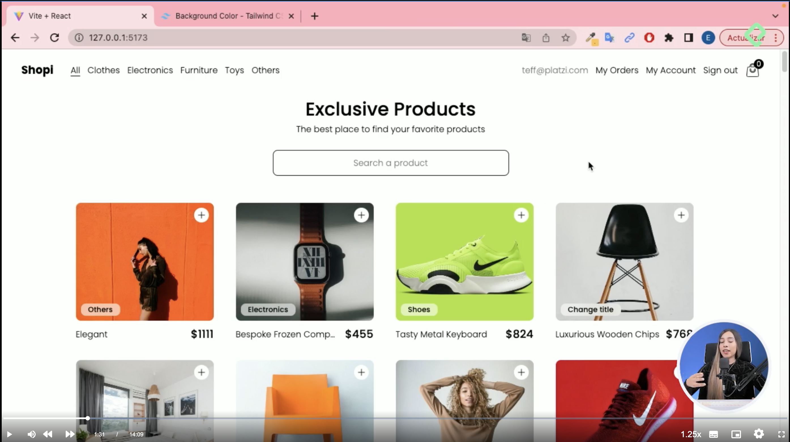

Al ver estas vistas, observamos que es la misma pantalla 'All' pero filtrada por tipos de producto, asi que podemos trabajar con la misma página 'All' para estas:

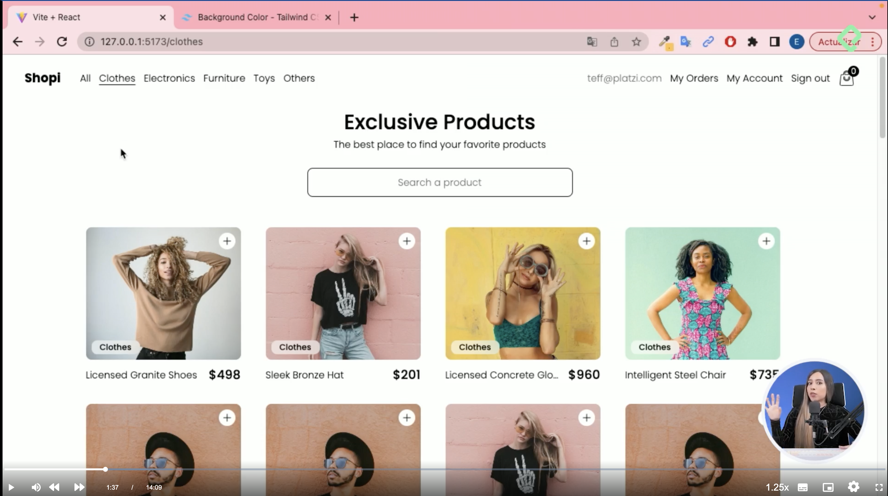
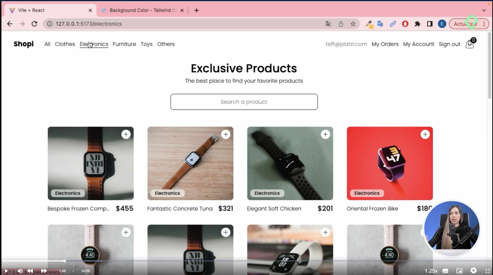
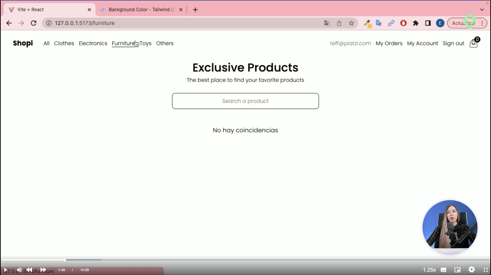
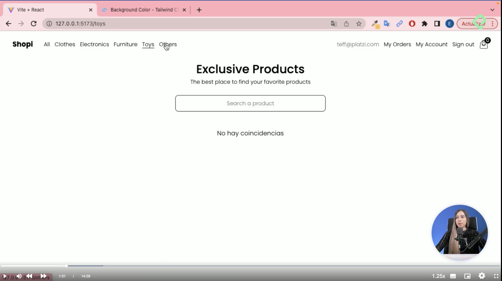
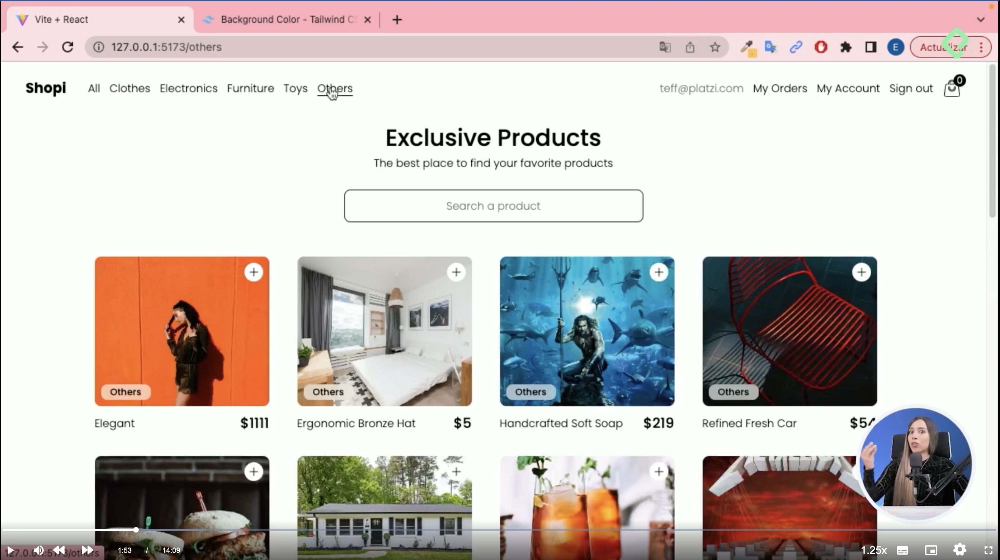

### PAGINA #2. MY ORDERS

Esta es la página dónde van las ordenes que se van generando, aunque por ahora está vacía, es una página principal:

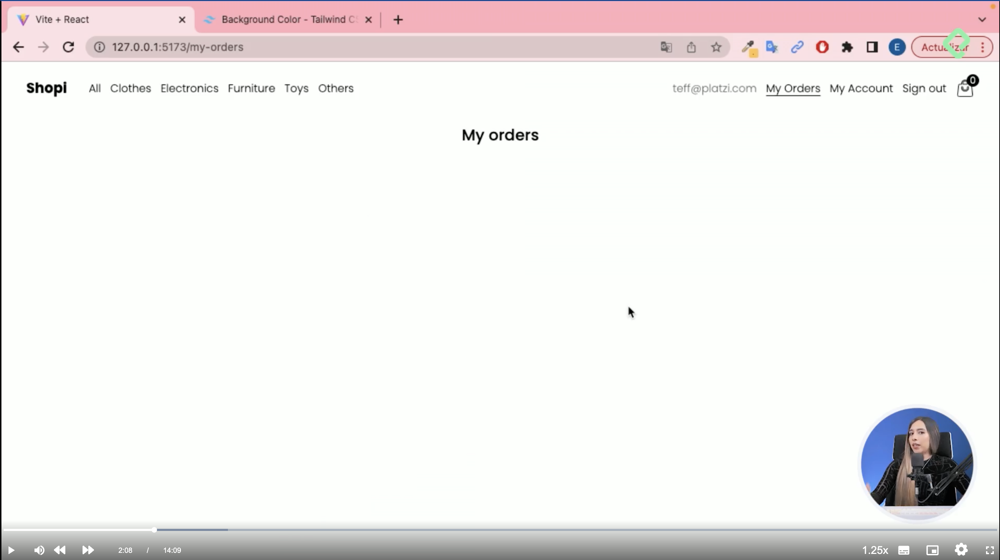

### PAGINA #3. MY ACCOUNT

Esta es la página del perfil, donde se puede editar la cuenta y demás:

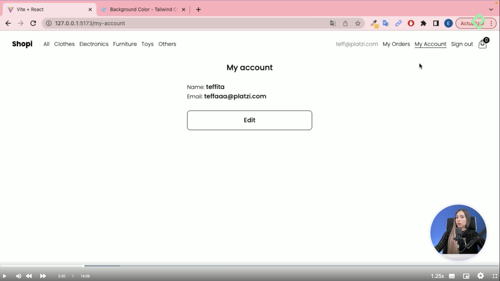

### PAGINA #4. SIGN IN

Aqui tenemos un formulario, donde hacemos log in y demás:

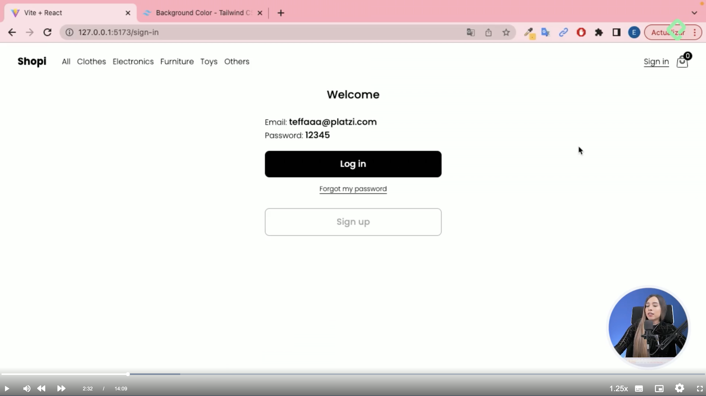

### PAGINA #5. MY ORDER

Cuando seleccionamos los productos que vamos a pedir en All o cualquiera de las páginas hijas, y agrega a una especie de carrito de compras, y damos click en el botón 'Checkout' nos lleva a una página que se llama 'My order':

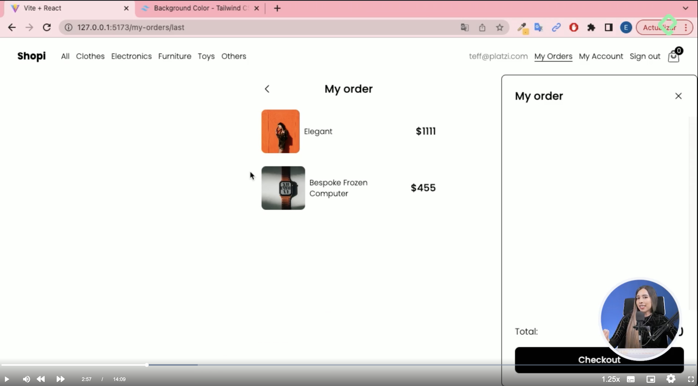

Estas 5 páginas serían entonces nuestros componentes padres, y ya después empezariamos entonces con el tema del redireccionamiento, que es, si damos clic en una de las páginas hijas entonces nos hace un enrutamiento en la url con un `/Clothes` o `/Furniture`.

2. Entonces desde la página principal, tenemos que decirle, quiero que vayas a este lugar o a este otro lugar. Ya tenemos una comprensión de cuales son las vistas principales, cuales son las páginas, y ahora lo que vamos a hacer es enlazarlas unas con otras. A continuación se muestra un esquema de como se distribuyen las páginas:

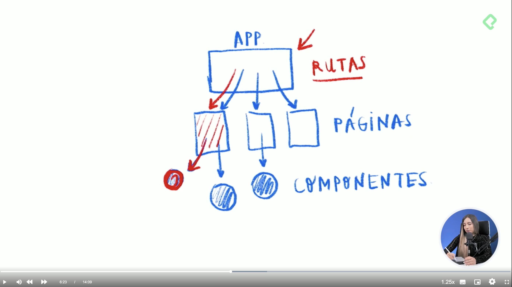

3. Vamos a VSC y creamos una carpeta que se llame `Pages`, y dentro creamos una carpeta por cada una de las páginas padre con su respectivo archivo 'index.jsx' y archivo 'style.css':
    - `App` => `index.jsx`
    - `Home` => `index.jsx`
    - `MyAccount` => `index.jsx`
    - `MyOrders` => `index.jsx`
    - `MyOrder` => `index.jsx`
    - `SignIn` => `index.jsx`
    - `NotFound` => `index.jsx`

4. Para cada una de las páginas creamos la estructura inicial del componente, ejemplo:

    import './App.css'

    function App() {
    return (
        <>
        

            App
        

        </>
    )
    }

    export default App;

5. Importamos desde el componente principal `App` todos los demás componentes:

    - `import Home from '../Home'`
    - `import MyAccount from '../MyAccount'`
    - `import MyOrder from '../MyOrder'`
    - `import MyOrders from '../MyOrders'`
    - `import NotFound from '../NotFound'`
    - `import SignIn from '../SignIn'`

6. De esta manera ya nos aparece en nuestra página principal, la prueba de que todos los componentes se reflejan en la página.

## Enrutamiento con React Router Dom

Ahora vamos a enlazar nuestras páginas con una ruta en específico, para ello vamos a instalar `React Router Dom`.

1. `npm install react-router-dom` => instalar en la terminal
2. `import { useRoutes } from 'react-router-dom';` => importamos este hook que vamos a utilizar
3. Creamos una función aparte del componente `App` donde vamos a asignar las rutas a los componentes
4. En el componente principal encapsulamos la función para poder visualizar en el navegador cada una de las rutas conectadas a los componentes => Ejemplo: `http://localhost:5173/sign-in`

