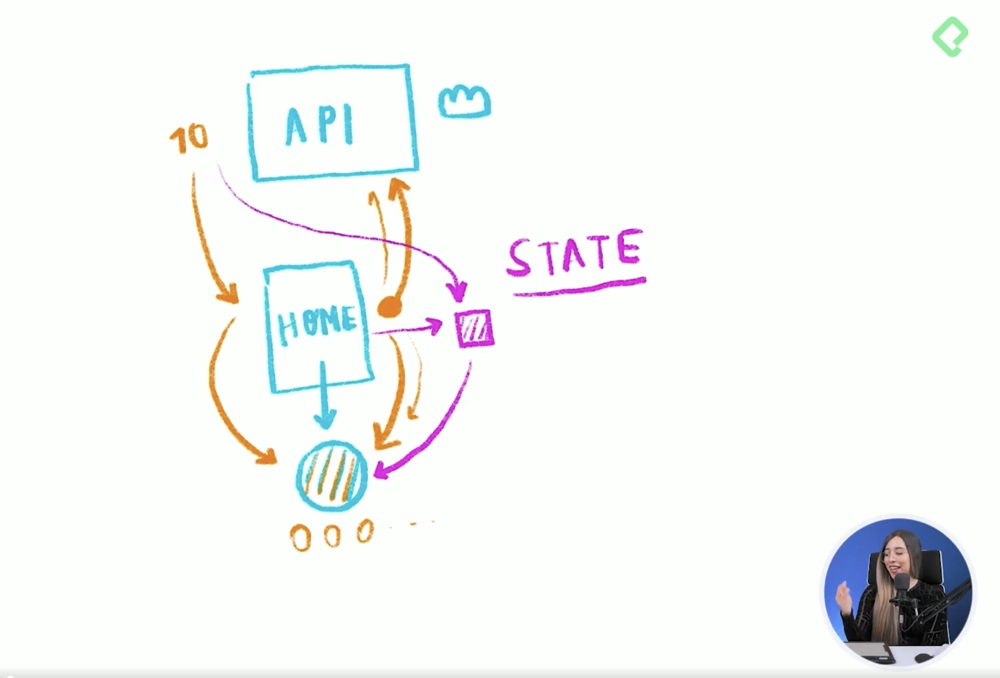

# CURSO DE REACT.JS COM VITE.JS Y TAILWINDCSS

## Instalación de React con Vite y TailwindCSS

### Creación del proyecto con Vite
1. Crear el proyecto con VITE => `npm create vite@latest`
2. Nombre del proyecto: `curso-react-vite-tailwind`
3. Seleccionar Framework: `React`
4. Seleccionar Variante: `Javascript`

### Instalación de tailwind en el proyecto
5. `npm install -D tailwindcss postcss autoprefixer` => para instalar tailwind, y crear los modulos y el package-lock.json
6. `npx tailwindcss init -p` => para crear el archivo `tailwind.config.js` y el archivo `postcss.config.js`
7. Agregamos las rutas en el archivo `tailwind.config.js`: `content: ["./public/index.html", "./src/**/*.{html,js,ts,jsx,tsx}"],`
8. Copiamos las directivas en la documentación de la página de tailwind, y las pegamos a nuestro archivo padre de css que se encuentra en la carpeta src, en la parte superior => `App.css`

    `@tailwind base;`
    `@tailwind components;`
    `@tailwind utilities;`

### Ejecución del proyecto vite con tailwind
9. Ejecutamos nuestro proyecto => `npm run dev`
10. Nos muestra el host local donde se ejecutará nuestro proyecto de VITE => `http://localhost:5173/`
11. Pegamos esta url en el navegador, y ya podemos ver nuestro proyecto de VITE
12. Como ya viene con algunas cosas predeterminadas con la marca de VITE y REACT, vamos a limpiarlo un poco
13. Eliminamos la carpeta `assets`
14. Borramos todos los estilos que vienen por defecto en el archivo `App.css` y el archivo `index.css` porque no los necesitamos, menos las directivas obviamente
15. Borramos todo el código del archivo `App.jsx` y dejamos únicamente la estructura de nuestro primer componente `App()`

### Creación y conexión de los repositorios
16. Creamos el repositorio remoto en github sin ningun archivo adicional
17. `git init` => creamos el repositorio local en git
18. `git add .` => preparamos todos los cambios hechos en la configuración
19. `git commit -m "first commit"` => hacemos el commit de la configuración inicial
20. `git branch -M main` => cambiamos la rama de master a main
21. `git remote add origin git@github.com:creacionfinanciera/curso-react-vite-tailwind.git` => conectamos los repositorios local y remoto
22. `git push -u origin main` => actualizamos el repositorio remoto con los cambios del repositorio local

## Análisis de rutas y componentes en React

1. Por dónde empezamos?, lo primero es reconocer las vistas que tenemos, cuales son las vistas padre?, a esas las vamos a llamar `pages` o páginas, y de ahí ya se empieza a desglosar toda la aplicación.

Necesitamos reconocer cuales son las vistas principales, las grandes, las que contienen todos los elementos.

### PAGINA #1. HOME

Esta podría ser la vista del home, que es dónde visualizamos todas las imagenes o los productos del ecommerce:

Al ver estas vistas, observamos que es la misma pantalla 'All' pero filtrada por tipos de producto, asi que podemos trabajar con la misma página 'All' para estas:

### PAGINA #2. MY ORDERS

Esta es la página dónde van las ordenes que se van generando, aunque por ahora está vacía, es una página principal:

### PAGINA #3. MY ACCOUNT

Esta es la página del perfil, donde se puede editar la cuenta y demás:

### PAGINA #4. SIGN IN

Aqui tenemos un formulario, donde hacemos log in y demás:

### PAGINA #5. MY ORDER

Cuando seleccionamos los productos que vamos a pedir en All o cualquiera de las páginas hijas, y agrega a una especie de carrito de compras, y damos click en el botón 'Checkout' nos lleva a una página que se llama 'My order':

Estas 5 páginas serían entonces nuestros componentes padres, y ya después empezariamos entonces con el tema del redireccionamiento, que es, si damos clic en una de las páginas hijas entonces nos hace un enrutamiento en la url con un `/Clothes` o `/Furniture`.

2. Entonces desde la página principal, tenemos que decirle, quiero que vayas a este lugar o a este otro lugar. Ya tenemos una comprensión de cuales son las vistas principales, cuales son las páginas, y ahora lo que vamos a hacer es enlazarlas unas con otras. A continuación se muestra un esquema de como se distribuyen las páginas:

3. Vamos a VSC y creamos una carpeta que se llame `Pages`, y dentro creamos una carpeta por cada una de las páginas padre con su respectivo archivo 'index.jsx' y archivo 'style.css':
    - `App` => `index.jsx`
    - `Home` => `index.jsx`
    - `MyAccount` => `index.jsx`
    - `MyOrders` => `index.jsx`
    - `MyOrder` => `index.jsx`
    - `SignIn` => `index.jsx`
    - `NotFound` => `index.jsx`

4. Para cada una de las páginas creamos la estructura inicial del componente, ejemplo:

    import './App.css'

    function App() {
    return (
        <>
        

            App
        

        </>
    )
    }

    export default App;

5. Importamos desde el componente principal `App` todos los demás componentes:

    - `import Home from '../Home'`
    - `import MyAccount from '../MyAccount'`
    - `import MyOrder from '../MyOrder'`
    - `import MyOrders from '../MyOrders'`
    - `import NotFound from '../NotFound'`
    - `import SignIn from '../SignIn'`

6. De esta manera ya nos aparece en nuestra página principal, la prueba de que todos los componentes se reflejan en la página.

## Enrutamiento con React Router Dom

Ahora vamos a enlazar nuestras páginas con una ruta en específico, para ello vamos a instalar `React Router Dom`.

1. `npm install react-router-dom` => instalar en la terminal
2. `import { useRoutes } from 'react-router-dom';` => importamos este hook que vamos a utilizar
3. Creamos una función aparte del componente `App` donde vamos a asignar las rutas a los componentes
4. En el componente principal encapsulamos la función para poder visualizar en el navegador cada una de las rutas conectadas a los componentes => Ejemplo: `http://localhost:5173/sign-in`

## Componente Navbar

Ahora vamos a crear nuestro componente de `Navbar`, primero vamos a crear ese componente así como hicimos con las páginas, luego de crearlo vamos a importarlo en nuestro componente principal o padre, que es 'App', y luego vamos a estilizar nuestro navbar.

1. Creamos una nueva carpeta llamada `Components`, dónde vamos a guardar todos los componentes que vamos a ir escribiendo
2. Creamos al interior otra carpeta llamada `Navbar`, y al interior un archivo llamado `index.jsx`
3. Consultamos la estructura de `Navlink` que nos propone `ReactRouter` en la siguiente página `https://reactrouter.com/en/main/components/nav-link`
4. Comenzamos a crear el componente bajo esta estructura

## Componente de Layout

Aqui vamos a crear el componente de layout, tenemos unas páginas padres como home, my account, my order, etc. Pero ellas necesitan tener una visualización similar, por ejemplo, que todo el contenido esté en el centro, que tenga un margen superior para que no se toque tanto por el navbar, y pequeños detalles que necesitamos que sean iguales en todas estas pantallas.

Para eso es que vamos a crear ese componente de layout, que va a tener esos estilos principales, y le vamos a colocar un pequeño hijo, y ese hijo va a ser home, my account, my orders, en fin. Asi que vamos a crearlo para poder encapsularlo en todas nuestras pantallas, y que ya tengamos el mismo estilo en todas esas páginas.

1. Creamos una nueva carpeta `Layout` y su respectivo archivo `index.js`
2. Creamos el componente `Layout`
3. Llamamos desde cada uno de las páginas a nuestro componente `Layout`, y ya todas estas páginas quedan con los estilos definidos en dicho componente

## Componente de Card

1. Creamos una nueva carpeta `Card` y su respectivo archivo `index.js`
2. Creamos el componente `Card`
3. Creamos la estructura del componente, según el contenido que tiene cada una de las cards
4. Damos los estilos respectivos a esta primera card, con tailwind css

## Consumiendo la FakeStore API para pintar cards

Ahora vamos a consumir la API de platzi, que es pública, dónde podemos también recibir esa información de los productos y poderlos pintar en nuestras cards, para poder visualizar esos productos y poder filtrarlos en las diferentes categorías que colocamos también en nuestro Navbar.

Para poder consumir una API es recomendable antes leer la documentación, para entender primero que es lo que nos está dando, y ya después empezar con el proceso de pintado, de transformación de datos y demás.

`https://fakeapi.platzi.com/` => vamos al sitio donde se encuentra la API, y entramos a la documentación dónde se encuentran los `endpoints`.

`https://fakestoreapi.com/products` => finalmente utilice esta API porque la de platzi no me funcionó bien

Nuestro componente `Home` es que va hasta la API y se trae toda la información de los productos y las imágenes, para posteriormente pintarlas en las distintas `Cards`, pero antes de hacer esto, creamos en `Home` un `STATE` que es unsa variable o una cajita, y en esa cajita va a almacenar toda la información que venga de la API, cuando Home ya la tenga ahí, entonces si la va a enviar a nuestras cards para pintarla.

1. Creamos el `estado` en nuestro componente `Home`
2. Luego consumimos la API con `useEffect`
3. Retornamos en el componente cada una de las imagenes en un componente Card
4. Llamamos desde el componente `Card` las propiedades que van en cada etiqueta y listo!

## Contexto global de la aplicación

Para comunicar o enlazar muchos elementos que deben estar interconectados unos con otros dentro de nuestra aplicación, para eso es mucho mejor que haya un estado global dentro de nuestra aplicación, para que se encargue de ser la fuente de verdad para poder mandarle información a todos los componentes y que nuestra aplicación pueda funcionar basada en esta fuente de verdad.

React tiene algo muy interesante que se llama `context`, que nos habla precisamente de un estado global en nuestra aplicación. La razón por la cual no nos sirve tener un estado local, es decir, yb estado dentro de un componente en específico, es porque ya necesitamos muchos request, muchas solicitudes, desde muchas partes de la aplicación, que estan en varios componentes.

Podriamos crear el contexto en el componente `App`, pero en este caso por organización lo vamos a dejar aparte, creando afuera una nueva carpeta llamada `Context` y dentro un archivo llamado `index.jsx`

## Abrir el detalle de cada producto

Creamos el componente `ProductDetail` en su propia carpeta, con su archivo `index.js` y hacemos los ajustes que se encuentran en el código.

## Reto: heroicons on TailwindCSS

1. Entramos a la página `https://heroicons.com/` y vemos la documentación
2. `npm install @heroicons/react` => instalamos la dependencia
3. `import { BeakerIcon } from '@heroicons/react/24/solid'` => Agregamos este import en la pagina de nuestro componente
4. `<BeakerIcon></BeakerIcon>` => lo usamos como si fuera un componente
5. `className="size-6 text-blue-500"` => le ponemos esta clase al componente
6. Vamos a la libreria en la página y buscamos el icono que necesitamos
7. Reemplazamos Beaker por el nombre del icono seleccionado, tanto en la importación como en el componente. No se incluye el guion que tiene el nombre en la librería

## SideMenu del Carrito de Compras

Ahora vamos a tomar toda esa información que acabamos de agregar a nuestro carrito de compras, y la idea es poderla visualizar en un menú lateral, entonces lo primero que debemos hacer es crear ese menú lateral que vamos a llamar `checkout side menu`, y luego vamos a crear unas pequeñas `Cards` donde vamos a visualizar esos componentes o esos productos que ya tenemos en nuestro e-commerce, para que se vean justamente en el carrito de compras.

Creamos una nueva carpeta `CheckoutSideMenu`, y adentro un archivo `index.jsx` y un archivo `style.css`.

 

